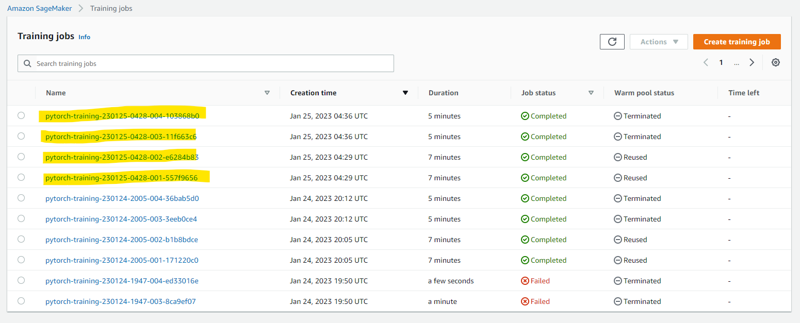
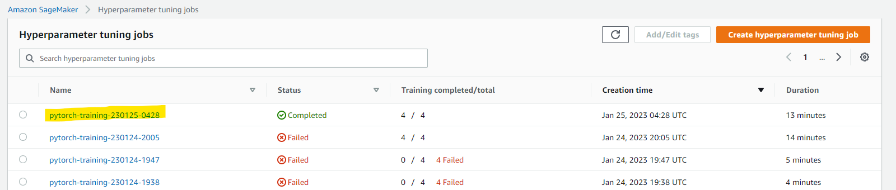
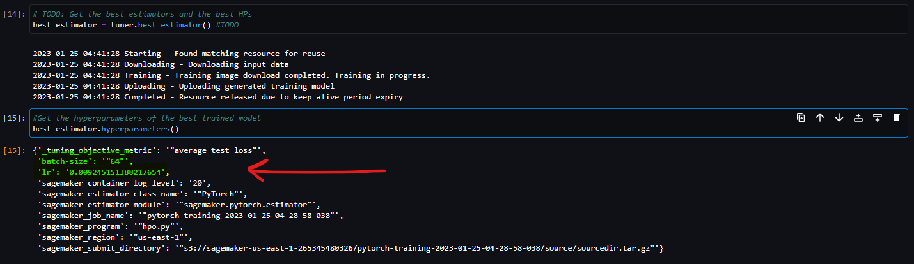
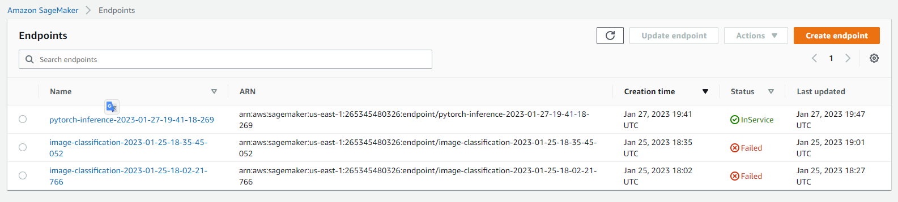

# Image Classification using AWS SageMaker

Use AWS Sagemaker to train a pretrained model that can perform image classification by using the Sagemaker profiling, debugger, hyperparameter tuning and other good ML engineering practices. This can be done on either the provided dog breed classication data set or one of your choice.

## Project Set Up and Installation
Enter AWS through the gateway in the course and open SageMaker Studio. 
Download the starter files.
Download/Make the dataset available. 

## Dataset
The provided dataset is the dogbreed classification dataset which can be found in the classroom.
The project is designed to be dataset independent so if there is a dataset that is more interesting or relevant to your work, you are welcome to use it to complete the project.

### Access
Upload the data to an S3 bucket through the AWS Gateway so that SageMaker has access to the data. 

## Hyperparameter Tuning
What kind of model did you choose for this experiment and why?
* I selected RESNET50 deep neural network to do image classification of dogbreed dataset. I selected this network because it is a convolutional neural network and it is good for image classification tasks.

Give an overview of the types of parameters and their ranges used for the hyperparameter search
* To use the right hyperparameter for this network I use a HPO by Sagemaker. I selected batch size and learning rate for optimization.

Remember that your README should:
- Include a screenshot of completed training jobs

- Logs metrics during the training process  (see attached CSV file: log-events-viewer-result.csv and log-events-viewer-result_2.csv)
- Tune at least two hyperparameters (see that in the above-mentioned file I logged the HPO tuned with label 'Batch size:' and 'Learning rate value')
- Retrieve the best best hyperparameters from all your training jobs. I show following a screen shot of the best HPO:

## Debugging and Profiling
**TODO**: Give an overview of how you performed model debugging and profiling in Sagemaker
Sagemaker has a library (named smdebug) that allows you to do the main task for debugging. It is necessary to define rules (e.g. vanishing gradient) and hook. The hook allows you to keep trace of selected parameters (e.g. training and validation loss). Rules and hooks shall be attached in the estimator definition.
Throught Profiling you can extract a report of the entire training process in HTML and PDF format.

### Results
**TODO**: What are the results/insights did you get by profiling/debugging your model?
This tools show me useful information regarding to:
- Overfit
- Overtraining
- PoorWeightInitialization
- LossNotDecreasing
- LowGPUUtilization
- ProfilerReport
According this results I can, for example, understand if the training process is in overfit or underfit condition

**TODO** Remember to provide the profiler html/pdf file in your submission.
Provided profile report with name: profiler-report.html

## Model Deployment
**TODO**: Give an overview of the deployed model and instructions on how to query the endpoint with a sample input.
My approch for model deploy is using the 'PyTorchModel' object. This object requires to specify the following:
- model_data: that is the path of artifacts that I saved with the previous training job
- role: the Sagemaker role
- framework and python version specification
- entry_point: it is a python file (named: inference.py included in my project folder) that specify 4 function to manage the model, the data and the inference at all.
- After created PyTorchModel, I launched the deploy procedure. 

**TODO** Remember to provide a screenshot of the deployed active endpoint in Sagemaker.
- Following you can see the screenshot of the active endpoint

## Standout Suggestions
**TODO (Optional):** This is where you can provide information about any standout suggestions that you have attempted.
I trying to explore the WebDataset FS importing from S3 bucket instead of use the ImageFolder method to create the loader.
I found out the it could be useful in those case that the dataset is very big.
